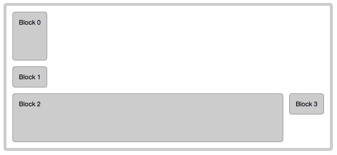
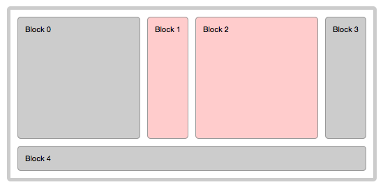
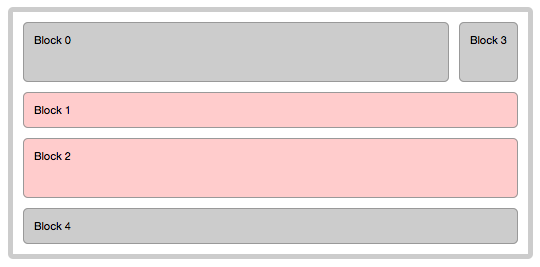

FLEX LAYOUT
==========

<br />
## 1. WHAT IS A FLEX LAYOUT?
<br />

FlexLayout, like any enyo layout kind, modifies how parent component ( **container** ) and it's **children** are displayed.
FlexLayout is providing for the arrangement of elements on a page such that the elements behave predictably when the page layout must accommodate different screen sizes and different display devices. 

For many applications, FlexLayout provides an improvement over the block model in that it does not use floats, device-inconsistent CSS3 flex-box, nor do the flex container's margins collapse with the margins of its contents. 

A fully-javascript implementation of FlexLayout provides controllable, consistent and easy to use JavaScript API that does not lack in performance speed.

<br />
## 2. API

<br />
### 2.1 Container properties ###
Container properties can be defined for component that specifies `layoutKind: 'enyo.FlexLayout'`.
<br />
<br />

###**flexSpacing**###
- Defines vertical and horizontal space in pixels between layout's child blocks.
- VALUES:   Integers greater than zero
- DEFAULT:  **0**
	
###**flexBias**###
- Defines mode of display, When it is set to 'column', the rows will be compounded into a column, otherwise the columns will be compounded into a row.
- VALUES: **row** | **column**
- DEFAULT: **row**
	
###**flexResponseWidth**###
- Defines pixel value threshold, which being crossed during resizing of viewport, triggers response strategies specified by `flexResponse` in it's child blocks.
- VALUES: Integer greater than zero
- DEFAULT: **0**
	

<br />
### 2.2 Child block properties ###
Child block properties can be defined for child components of control that specifies `layoutKind: 'enyo.FlexLayout'`.
<br />
<br />

### **flex** ###
- Defines whether block is to occupy the remaining space in row or column group, shared with other `flex:true` blocks. 
- VALUES:   Boolean **true** | **false**
- DEFAULT:  **false**

### **fit** ###
-  Alias of **flex**, for backward compatibility with FittableLayout

### **flexOrient** ###
- Defines how block is oriented amongst others.
- VALUES:   **row** | **column**
- DEFAULT:  **defaults to container's flexBias**

### **flexStretch** ###
- Controls vertical stretch of non-flex columns and horizontal stretch of non-flex rows.
- VALUES:   Boolean **true** | **false**
- DEFAULT:  **true**

### **flexOrder** ###
- Defines display order of a block within layout.
- VALUES:   Integer value greater than zero
- DEFAULT:  **Defaults to block's order of definition within FlexLayout parent**

### **flexResponse** ###
- Defines strategy name to be triggered when flexResponseWidth threshold has been crossed during change in container width
- VALUES:   String corresponding to a name of a ResponseStrategy kind
- DEFAULT:  **NA**


<br />
## 3. USAGE OF FLEX LAYOUT

<br />
### 3.1 Default look
<br />

Let's start with the following simple code example:

	```javascript
	enyo.kind({
		name        : 'enyo.sample.FlexLayoutSample',
		classes     : 'flex-container enyo-fit',
		layoutKind  : 'enyo.FlexLayout',
		components  : [
			{content: 'Block 1'},
			{content: 'Block 2'},
			{content: 'Block 3'}
		]}
	);
	```
	
Now apply these styles to it:

	```css
	.flex-container {
		font-size     : 11px;
		border        : 5px solid #CCC;
		padding       : 10px;
		margin        : 10px;
		border-radius : 5px;
	}

		.flex-container > * {
			background-color : #CCC;
			text-align       : justify;
			border           : 1px solid #999;
			padding          : 10px;
			border-radius    : 5px;
		}
	```
	
We will get the following result:


As you can see, even though FlexLayout is fully-javascript and all children are absolutely positioned, all paddings, margins and borders are in place in both, container and it's children.

<br />
### 3.2 Flex Spacing and FLEX:TRUE
<br />

Now, let's add **flexSpacing** and **flex: true** property on Block2:

	```javascript
	enyo.kind({
		name        : 'enyo.sample.FlexLayoutSample',
		classes     : 'flex-container enyo-fit',
		layoutKind  : 'enyo.FlexLayout',
		flexSpacing : 10,
		components  : [
			{content: 'Block 1'},
			{content: 'Block 2', flex: true},
			{content: 'Block 3'}
		]}
	);
	```
	
The result will be:


You can have as many *flex:true* blocks as you wish. As you resize the browser window, *flex:true* blocks will stretch to share the space left by non-flex blocks.

<br />
### 3.3 Using flexOrient
<br />

Let's extend this example by adding one more *flex:true* block, and **flexOrient** to all blocks:


	```javascript
	enyo.kind({
		name        : 'enyo.sample.FlexLayoutSample',
		classes     : 'flex-container enyo-fit',
		layoutKind  : 'enyo.FlexLayout',
		flexSpacing : 10,
		components  : [
			{content: 'Block 0', flexOrient: 'row', flex: true},
			{content: 'Block 1', flexOrient: 'row'},
			{content: 'Block 2', flexOrient: 'column', flex: true},
			{content: 'Block 3', flexOrient: 'column'}
		]}
	);
	```

This will render into:


Note a few things:

- Block2 now flexes in horizontal axis as the window is resized. 
- Column groups automatically comprise flex:true row.
- Height left by non-flex Block1 is equally shared between Block0 and last row comprised of columns Block2 and Block3, because the last row has automatically became *flex:true*

<br />
### 3.4 Using flexBias
<br />

In the previous example there was one more assumption: the preference is given to rows over columns. 
For example we are grouping columns into a row and not the other way around. This preference is called **flexBias**.

Let's change that by specifying *flexBias*, that by default has value *"row"**:

	```javascript
	enyo.kind({
		name        : 'enyo.sample.FlexLayoutSample',
		classes     : 'flex-container enyo-fit',
		layoutKind  : 'enyo.FlexLayout',
		flexSpacing : 10,
		flexBias    : 'column',
		components  : [
			{content: 'Block 0', flexOrient: 'row', flex: true},
			{content: 'Block 1', flexOrient: 'row'},
			{content: 'Block 2', flexOrient: 'column', flex: true},
			{content: 'Block 3', flexOrient: 'column'}
		]}
	);
	```
	
Now the entire grid is biased to see columns as main blocks, not rows. I.e, rows grouped into columns, not columns into rows:


Now, let's remove *flexOrient: 'row'* from Block0 and Block1, leaving *flexOrient* to it's default value:

	```javascript
	enyo.kind({
		name        : 'enyo.sample.FlexLayoutSample',
		classes     : 'flex-container enyo-fit',
		layoutKind  : 'enyo.FlexLayout',
		flexSpacing : 10,
		flexBias    : 'column',
		components  : [
			{content: 'Block 0', flex: true},
			{content: 'Block 1'},
			{content: 'Block 2', flexOrient: 'column', flex: true},
			{content: 'Block 3', flexOrient: 'column'}
		]}
	);
	```
	
	


The *flexOrient* value defaults to *flexBias*, which defaults to 'row'. To see that, let's remove *flexBias*:

	```javascript
	enyo.kind({
		name        : 'enyo.sample.FlexLayoutSample',
		classes     : 'flex-container enyo-fit',
		layoutKind  : 'enyo.FlexLayout',
		flexSpacing : 10,
		components  : [
			{content: 'Block 0', flex: true},
			{content: 'Block 1'},
			{content: 'Block 2', flexOrient: 'column', flex: true},
			{content: 'Block 3', flexOrient: 'column'}
		]}
	);
	```
	


We are back to configuration that we've already seen above.

<br />
### 3.5 Using flexStretch
<br />

Now, lets take a look at **flexStrech**, it is a child block property that controls vertical stretch of columns and horizontal stretch of rows.

Let's add `flexStretch: false` to our layout:

	```javascript
	enyo.kind({
		name        : 'enyo.sample.FlexLayoutSample',
		classes     : 'flex-container enyo-fit',
		layoutKind  : 'enyo.FlexLayout',
		flexSpacing : 10,
		flexStretch : false,
		components  : [
			{content: 'Block 0', flex: true},
			{content: 'Block 1'},
			{content: 'Block 2', flexOrient: 'column', flex: true},
			{content: 'Block 3', flexOrient: 'column'}
		]}
	);
	```
	
All blocks except flexible Block 2 are no longer stretched.

The result will look like this:



<br />
### 3.6 Using flexOrder
<br />

What if we want to change the order in which the blocks are displayed? Yes, we can do that by specifying **flexOrder** property. 
Let's move column group to the top:

	```javascript
	enyo.kind({
		name        : 'enyo.sample.FlexLayoutSample',
		classes     : 'flex-container enyo-fit',
		layoutKind  : 'enyo.FlexLayout',
		flexSpacing : 10,
		components  : [
			{content: 'Block 0', flex: true},
			{content: 'Block 1'},
			{content: 'Block 2', flexOrient: 'column', flexOrder: 0, flex: true},
			{content: 'Block 3', flexOrient: 'column', flexOrder: 1}
		]}
	);
	```


<br />
## 4. RESPONSIVE DESIGN WITH FLEX LAYOUT
<br />

Flex layout's all-javascript implementation makes possible to control how layout responds to changes in the size of the viewport.

Having explored *flexOrient* and *flexOrder*, we can see how by changing them a responsive design can be achieved.

Consider the following code:

	```javascript
	enyo.kind({
	    name         : 'enyo.sample.FlexLayoutSample',
	    classes      : 'flex-container enyo-fit',
	    layoutKind   : 'enyo.FlexLayout',
	    flexSpacing  : 10,
		flexResponseWidth : '500',
	    components  : [
	        {content: 'Block 0', flexOrient: 'column', flex: true},
	        {content: 'Block 1', flexOrient: 'column', flexResponse : 'RowAfterColumns', style: 'background-color: #FFCCCC'},
	        {content: 'Block 2', flexOrient: 'column', flexResponse : 'RowAfterColumns', style: 'background-color: #FFCCCC', flex: true},
	        {content: 'Block 3', flexOrient: 'column'},
			{content: 'Block 4'}
	    ]}
	);
	```
	
	
You can see two new things **flexResponse** at block level and **flexResponseWidth** at container level.
It simply means that when width of container has changed to cross 500px threshhold, flexResponse, such as *RowAfterColumns* will be applied to change how block 1 and block 2 are laid out.

At >= 500 pixel size it will look like this:



Now, lets resize the window to < 500 pixel size:



This kind of strategy may be useful when transiting from a desktop viewport to a smartphone viewport, to arbitrarily turn parts of horizontal content into vertical, scrollable content.

*RowAfterColumns* is one of but many strategies that can be defined to reconfigure FlexLayout. It resides in `flex/source/ResponseStrategies/kind.RowAfterColumns'. Let's take a look at the code and learn how to define it:

	```javascript
	/**
	 * enyo.FlexLayout.ResponseStrategy.RowAfterColumns kind definition
	 * @author: Lex Podgorny
	 */

	enyo.FlexLayout.ResponseStrategy.RowAfterColumns = enyo.singleton({
		kind: 'enyo.FlexLayout.ResponseStrategy',
		_getPositionAfterColumns: function(oControl) {
			var n         = 0,
				bFound    = false,
				aChildren = oControl.parent.children,
				nChildren = aChildren.length;
			
			for (;n<nChildren; n++) {
				if (aChildren[n] == oControl) {
					bFound = true;
					continue;
				}
				if (bFound && aChildren[n].flexOrient != 'column') {
					return n - 1;
				}
			}
			return -1;
		},
		respond: function(oControl, bIncreasing) {
			this.inherited(arguments);
			if (bIncreasing) {
				this.reverseProperty(oControl, 'flexOrder');
				this.reverseProperty(oControl, 'flexOrient');
			} else {
				this.setProperty(oControl, 'flexOrder', this._getPositionAfterColumns(oControl));
				this.setProperty(oControl, 'flexOrient', 'row');
			}
		}
	});
	```
	
Response strategies of FlexLayout are singletons that inherit from `enyo.FlexLayout.ResponseStrategy` which defines useful methods like `setProperty` and `reverseProperty`, methods that keep the state of how block of FlexLayout has been modified when the *flexResponseWidth* threshold has been crossed the last time.

After taking a quick look at `_getPositionAfterColumns` which simply finds where the current set of columns end, let's see `respond` method, which every FlexLayout response strategy has to have.

This function is called on *flexResponseWidth* threshold crossing.
It takes two parameters, `oControl` and `bIncreasing` - object and boolean. oControl is the FlexLayout child block that has this strategy specified. 
bIncreasing gives us the direction of crossing.

If we've crossed the threshold towards bigger container size, it simply reverses the values that may have been set when we crossed it in the opposite direction.

Else, if we've crossed the threshold towards smaller container size, it sets the flexOrder of block to a position after all columns adjacent to itself. Then, it turns it into a row.


